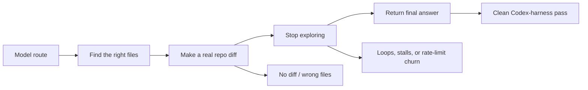

# codex-litellm

`codex-litellm` is upstream Codex CLI with a maintained LiteLLM patchset.

It keeps the Codex agent loop, but lets you run it against agentic models from many providers through one LiteLLM gateway.

- Software license: Apache-2.0
- Documentation license: CC BY 4.0
- Current upstream base: `rust-v0.116.0`
- Default runtime path: LiteLLM `/responses`

## What This Is

Official Codex is still the right answer when you want the official hosted harness and the best-supported OpenAI path.

`codex-litellm` is for a different job:
- one Codex CLI talking to many providers through LiteLLM
- agentic repo editing with non-OpenAI models
- fast model experimentation without abandoning the Codex workflow
- a patchset that stays close to upstream instead of becoming a permanent fork

## Research Snapshot

This README is not only setup documentation. It is also the current live research report for which non-OpenAI routes are actually usable inside the Codex harness.

Short version:
- start with `vercel/minimax-m2.7-highspeed`
- if you want a cheaper serious option, try `vercel/claude-haiku-4.5`
- keep `vercel/gemini-3.1-pro-preview`, `vercel/grok-4.20-reasoning-beta`, `vercel/glm-5-turbo`, and `vercel/kimi-k2.5` in the research lane
- do not spend time debugging `vercel/deepseek-v3.2-thinking` on this stack until the LiteLLM `/responses` bridge issue is fixed

## How To Read The Results

These ratings come from live `codex-litellm` runs through the Codex harness, not from benchmark claims, API pings, or chatbot feel.

A model is only useful here if it can:
- inspect a real repository
- use tools correctly
- make a real repo diff
- stop after the edit instead of looping
- return a final assistant answer

Good benchmark scores are not enough.

## Research Method

The current research bench uses the same Codex harness users run, with real repository fixtures and real `git diff` checks.

| Fixture | What it probes | Pass condition |
| --- | --- | --- |
| `mini-web` | lightweight UI edit loop | model must inspect, edit, and finish a concrete button restyle |
| `python-cli` | multi-file procedural edit loop | model must change `README.md`, `src/fixture_cli/cli.py`, and `tests/test_cli.py` |
| `calibre-web` | heavier real-world repo stress | exploratory probe for large-repo tool use, route stability, and follow-through |

The current prompt family is intentionally explicit. It is designed to prevent fake passes where a model says the work is already done.



## Current Recommendation

Current agentic shortlist on the LiteLLM `/responses` path:
- `Recommended default`: `vercel/minimax-m2.7-highspeed`
- `Recommended cheaper second option`: `vercel/claude-haiku-4.5`
- `Research lane`: `vercel/glm-5-turbo`, `vercel/gemini-3.1-pro-preview`, `vercel/grok-4.20-reasoning-beta`, `vercel/kimi-k2.5`
- `Blocked`: `vercel/deepseek-v3.2-thinking`

## Feasibility By Model

### Scoreboard

| Model | `mini-web` | `python-cli` | `calibre-web` exploratory | What usually goes wrong | Current recommendation |
| --- | --- | --- | --- | --- | --- |
| `vercel/minimax-m2.7-highspeed` | PASS | PASS | FAIL under route pressure, no clean diff on the latest heavy probe | larger repos currently amplify retry or 429 noise | best default |
| `vercel/claude-haiku-4.5` | PASS | PASS | not yet cleanly completed in the latest heavy probe batch | needs more large-repo evidence | best cheaper second option |
| `vercel/glm-5-turbo` | FAIL | FAIL | FAIL | retry and 429 noise before a useful diff | research only |
| `vercel/gemini-3.1-pro-preview` | EDITS, THEN STALLS | TIMEOUT | blocked by current gateway credits on the latest heavy probe | post-edit finalization is still too weak, and heavy-repo results are currently confounded by billing state | watchlist only |
| `vercel/grok-4.20-reasoning-beta` | PASS | FAIL | incomplete probe | can look strong on light UI work, then fail to produce a qualifying diff on procedural work | watchlist only |
| `vercel/kimi-k2.5` | FAIL | PASS | blocked by current gateway credits on the latest heavy probe | behavior is fixture-sensitive; it handles procedural edits better than broad UI hunting | research only |
| `vercel/deepseek-v3.2-thinking` | BLOCKED | BLOCKED | not worth probing further until bridge fix | LiteLLM `/responses` tool-follow-up incompatibility | blocked on this stack |

### What The Table Actually Means

- `PASS` means the model completed a Codex-harness run with a real repo diff and a final answer.
- `EDITS, THEN STALLS` means the model found the right change, but did not exit cleanly enough to be trustworthy.
- `FAIL` means it either never produced the required diff or collapsed into retries, rate limits, or a no-op finish.
- `BLOCKED` means the problem is below normal model quality. The current bridge path is incompatible.

### Reliability Read

| Tier | Models | Why |
| --- | --- | --- |
| Default-safe today | `vercel/minimax-m2.7-highspeed` | best combination of real passes, cost, and clean completion loop |
| Serious secondary option | `vercel/claude-haiku-4.5` | clears the current light and medium fixtures with better cost discipline than many frontier routes |
| Research lane | `vercel/kimi-k2.5`, `vercel/glm-5-turbo`, `vercel/gemini-3.1-pro-preview`, `vercel/grok-4.20-reasoning-beta` | each shows some useful capability, but not enough consistency to recommend as defaults |
| Blocked lane | `vercel/deepseek-v3.2-thinking` | current LiteLLM `/responses` bridge cannot reliably carry tool-follow-up turns |

## What This Tells Users

- if you want the highest first-run odds, use `vercel/minimax-m2.7-highspeed`
- if you want a cheaper serious option, use `vercel/claude-haiku-4.5`
- if you want to debate frontier-model upside, keep `vercel/gemini-3.1-pro-preview` and `vercel/grok-4.20-reasoning-beta` in the bench, not as your default daily route
- do not over-read Kimi's current mixed picture; it is not dead, but it is not stable enough to recommend broadly
- do not treat GLM failures as proof that the model family is bad; current evidence says the route is still too noisy on this endpoint
- do not spend premium-model money through a weak bridge path when the official harness would do the job better

## What This Tells Maintainers

The current frontier-model debates are less about raw intelligence and more about where the Codex harness fails under a given route.

| Failure class | Models where it shows up now | Likely implication |
| --- | --- | --- |
| post-edit finalization drift | `vercel/gemini-3.1-pro-preview` | strengthen "edit once, then finalize" steering after the first qualifying diff |
| route-pressure or retry churn on larger repos | `vercel/minimax-m2.7-highspeed`, `vercel/glm-5-turbo`, `vercel/grok-4.20-reasoning-beta` | improve retry budgeting, backoff, and possibly trim exploration pressure on large repos |
| fixture-shape sensitivity | `vercel/kimi-k2.5` | keep testing both UI-style and procedural fixtures; do not collapse judgment from one fixture only |
| billing or route-access exhaustion | `vercel/gemini-3.1-pro-preview`, `vercel/kimi-k2.5` on the latest heavy probe | do not mistake `402 Payment Required` for model weakness; fail fast instead of retrying |
| bridge-level incompatibility | `vercel/deepseek-v3.2-thinking` | fix LiteLLM `/responses` follow-up handling or add a model-specific fallback path |

Practical conclusion:
- some routes will graduate simply with time as providers stabilize
- some routes will graduate because `codex-litellm` gets slightly better finalization or retry behavior
- DeepSeek looks different from the rest; it currently needs a bridge fix, not just better steering

## Economics Warning

If you want to spend premium money on expensive frontier models, ask whether LiteLLM is adding value for that run.

If the goal is simply "best possible flagship Codex experience", the official harness is usually the better value:
- less bridge complexity
- fewer provider quirks
- less money wasted debugging endpoint behavior instead of doing work

`codex-litellm` is strongest when you want:
- model choice
- cost control
- experimentation across providers
- good-enough agentic performance from non-OpenAI routes

## Install

```bash
npm install -g @avikalpa/codex-litellm
```

This installs:

```bash
codex-litellm
```

The npm package downloads a prebuilt binary from GitHub Releases for your platform.

## Quick Start

Use the normal Codex home at `~/.codex`.

The intended UX is that `codex-litellm` only needs two LiteLLM-specific inputs beyond plain Codex:
- `LITELLM_BASE_URL`
- `LITELLM_API_KEY`

Put them in `~/.codex/.env`:

```bash
mkdir -p ~/.codex
cat > ~/.codex/.env <<'EOF2'
LITELLM_BASE_URL=http://localhost:4000/v1
LITELLM_API_KEY=your-litellm-api-key
EOF2
```

Then configure the LiteLLM provider in `~/.codex/config.toml`:

```toml
[model_providers.litellm]
name = "LiteLLM"
base_url = "http://localhost:4000/v1"
env_key = "LITELLM_API_KEY"
wire_api = "responses"

[profiles.codex-litellm]
model = "vercel/minimax-m2.7-highspeed"
```

Why the dedicated profile matters:
- plain `codex` and `codex-litellm` can share `~/.codex`
- the remembered model choice lives under the `codex-litellm` profile instead of stomping the default Codex model selection

Start the CLI:

```bash
codex-litellm
```

Or run one-shot commands:

```bash
codex-litellm exec "Summarize this repository"
codex-litellm exec "Refactor this function" --model vercel/minimax-m2.7-highspeed
```

## `/responses` Is The Supported Path

`codex-litellm` now treats LiteLLM `/responses` as the forward path.

That means:
- new work is validated against `/responses`
- model curation is based on `/responses` behavior
- known-broken `/responses` routes are documented plainly instead of hidden behind fallback magic

DeepSeek is the clearest current example:
- the model family matters
- but the current blocker here is the LiteLLM `/responses` bridge for tool-follow-up turns
- until that bridge is fixed, DeepSeek is not a recommended Codex route on this stack

## Semantic Cache

If your LiteLLM deployment supports semantic cache, use it.

The practical pattern is:
- keep the expensive reasoning model for actual turns
- use a cheap embedding route for cache lookup

A good shape is:
- `vercel/gemini-embedding-001`

Why this matters:
- cache probes become almost zero-cost relative to a full agentic turn
- repeated repo-edit loops cost less
- you get the benefit at the LiteLLM layer without adding more cache logic to `codex-litellm`

## Smoke Bench

The repository includes a public smoke bench that:
- resolves live model IDs from your LiteLLM `/v1/models`
- sanitizes private route segments before writing public output
- runs real Codex-harness repo-edit tasks, not toy prompt checks
- refuses to call a run a pass unless it produces a non-empty repo diff

The lower-level smoke helper also resolves public two-segment slugs like `vercel/claude-haiku-4.5` to the current live gateway route before the run starts, so research does not fail just because the gateway inserted a private middle segment.

Current active bench focus:
- `vercel/minimax-m2.7-highspeed`
- `vercel/glm-5-turbo`
- `vercel/kimi-k2.5`
- `vercel/claude-haiku-4.5`

Current watchlist bench:
- `vercel/gemini-3.1-pro-preview`
- `vercel/grok-4.20-reasoning-beta`

DeepSeek is tracked separately as a blocked `/responses` route, not as a default public bench candidate.

The fixture gates are intentionally different:
- `mini-web` checks whether a model can inspect, edit, and finalize a concrete UI restyle
- `python-cli` requires diffs in the CLI file, the README, and the test file, so partial edits do not count as a pass
- `calibre-web` is the heavier real-world probe for large-repo search, edit discipline, and route stability

Run it with:

```bash
scripts/run-public-smoke-bench.sh --profile ~/.codex
```

## Common Pitfalls

- Do not start with non-agentic models.
- Do not assume a model listed on `/v1/models` is ready for Codex-style work.
- Do not assume benchmark rank means good tool behavior.
- Do not assume one passing fixture means a model is fully green.
- Do not assume one failing fixture means the whole model family is dead.
- Do not assume DeepSeek is usable on this LiteLLM `/responses` bridge today.
- Do not spend premium-model money through a weak bridge path when the official harness would do the job better.

## Troubleshooting

If a model behaves badly:
1. Confirm your LiteLLM gateway is reachable.
2. Confirm the route exists on `/v1/models`.
3. Retry with MiniMax before blaming the patchset.
4. Run `scripts/run-public-smoke-bench.sh --profile ~/.codex`.

If install fails:
1. Verify GitHub Releases is reachable.
2. Re-run `npm install -g @avikalpa/codex-litellm`.
3. If your platform is unsupported, build from source.

## Project Direction

The goal is not to outgrow Codex.

The goal is to keep upstream Codex usable over LiteLLM while staying honest about:
- provider quirks
- model quirks
- telemetry and reproducibility
- economics versus hype
- portability of the patchset to the next stable upstream tag

## For Developers

User-facing docs live here in `README.md`.

Operator docs live in:
- `AGENTS.md`
- `agent_docs/`
